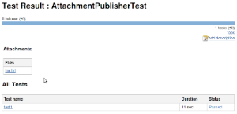

# JUnit Attachments Plugin

This plugin can archive certain files (attachments) together with your JUnit results.

Attached files are shown in the JUnit results.

Image attachments are shown inline.

To activate this plugin, configure your job with "Additional test report features" and select "Publish test attachments".

## How to attach files
### By putting them into a known location

One way to do this is to produce files from your tests into a known location.

* Jenkins looks for the JUnit XML report.
* Then it looks for a directory with the name of the test class, in the same directory as the XML report.
* Every file in this directory will be archived as an attachment to that test class.

#### Example:

* test report in `.../target/surefire-reports/TEST-foo.bar.MyTest.xml`
* test class is `foo.bar.MyTest`
* test attachment directory: `.../target/surefire-reports/foo.bar.MyTest/`

### By printing out the file name in a format that Jenkins will understand

The above mechanism has a problem that your test needs to know about where your test driver is producing reports to. This 2nd approach eliminates that problem by simply letting you print out arbitrary file names to stdout/stderr in the following format:

`[[ATTACHMENT|/absolute/path/to/some/file]]`

Each `ATTACHMENT` should be on its own line, without any text before or after.
See [Kohsuke's post](https://kohsuke.org/2012/03/13/attaching-files-to-junit-tests/) for more details.
