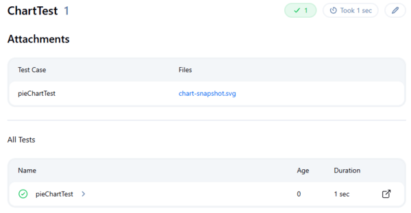
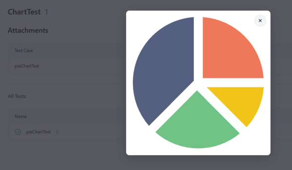

# JUnit Attachments Plugin

[](https://plugins.jenkins.io/junit-attachments)
[](https://github.com/jenkinsci/junit-attachments-plugin/releases/latest)
[](https://github.com/jenkinsci/junit-attachments-plugin/blob/main/LICENSE.md)

This plugin can archive certain files (attachments) together with your JUnit results.


Attached files are shown in the JUnit results.

Image attachments can be shown in a popup.



## Using the plugin
### Pipeline
Make sure your pipeline script contains a `junit` step. You can activate attachments publishing like this:

```groovy
junit testResults: '**/*.xml', testDataPublishers: [attachments()]
```
See [JUnit step documentation](https://www.jenkins.io/doc/pipeline/steps/junit/#junit-archive-junit-formatted-test-results)
or pipeline syntax help in your Jenkins instance for available options.

### Freestyle job
To activate this plugin in a freestyle job, configure your job with "Additional test report features" 
and select "Publish test attachments".

## How to attach files
### By putting them into a known location

One way to do this is to produce files from your tests into a known location.

* Jenkins looks for the JUnit XML report.
* Then it looks for a directory with the name of the test class, in the same directory as the XML report.
* Every file in this directory will be archived as an attachment to that test class.

#### Example:

* test report in `.../target/surefire-reports/TEST-foo.bar.MyTest.xml`
* test class is `foo.bar.MyTest`
* test attachment directory: `.../target/surefire-reports/foo.bar.MyTest/`

### By printing out the file name in a format that Jenkins will understand

The above mechanism has a problem that your test needs to know about where your test driver is producing reports to. This 2nd approach eliminates that problem by simply letting you print out arbitrary file names to stdout/stderr in the following format:

`[[ATTACHMENT|/absolute/path/to/some/file]]`

Each `ATTACHMENT` should be on its own line, without any text before or after.
See [Kohsuke's post](https://kohsuke.org/2012/03/13/attaching-files-to-junit-tests/) for more details.

## Attachment storage

Attachments are archived through Jenkins' pluggable
[`ArtifactManager`](https://javadoc.jenkins.io/hudson/model/Run.html#pickArtifactManager--) abstraction,
the same mechanism used for ordinary build artifacts. This means:

* By default (no artifact manager plugin configured), attachments are stored as regular files on the
  controller alongside the build's other archived artifacts, under
  `$JENKINS_HOME/jobs/.../builds/<#>/archive/junit-attachments/`.
* If a cloud artifact manager is configured globally (e.g.
  [Azure Artifact Manager](https://plugins.jenkins.io/azure-artifact-manager/),
  [S3](https://plugins.jenkins.io/artifact-manager-s3/), or similar), attachments are uploaded to that
  backend instead, alongside the build's other artifacts. **No attachment payload is written to the
  controller's filesystem** in this case.
* Attachments are listed and retained the same way as other build artifacts. Jenkins removes them
  whenever it removes a build's artifacts: when the build is deleted, or when a build discarder's
  artifact limits (e.g. "Max # of builds to keep with artifacts") apply. For a cloud backend, Jenkins
  asks the artifact manager to delete them; whether the stored objects are actually removed then depends
  on that plugin's configuration, and the backend may apply its own retention rules as well.
* Builds recorded by older versions of this plugin remain readable: the attachment viewer falls back to
  the legacy location, `$JENKINS_HOME/jobs/.../builds/<#>/junit-attachments/`, when a build predates
  this change.

### Testing against Azure Blob Storage (Azurite emulator)

`AzureArtifactManagerAzuriteTest` exercises this plugin against the real
[Azure Artifact Manager plugin](https://github.com/jenkinsci/azure-artifact-manager-plugin) backed by the
[Azurite](https://github.com/Azure/Azurite) storage emulator, so cloud storage support can be validated
without a real Azure account. It runs automatically as part of the normal test suite (`mvn test`/`mvn
verify`, no profile needed) using [Testcontainers](https://www.testcontainers.org/) to start and stop a
disposable Azurite container per run; the only prerequisite is a running Docker daemon.

It independently verifies, via the Azure SDK, that the exact expected blob bytes were uploaded; confirms
attachments remain downloadable through the normal JUnit attachment URLs; and asserts no attachment payload
exists on the controller's filesystem.

## License

Licensed under MIT, see [LICENSE](LICENSE.md)
